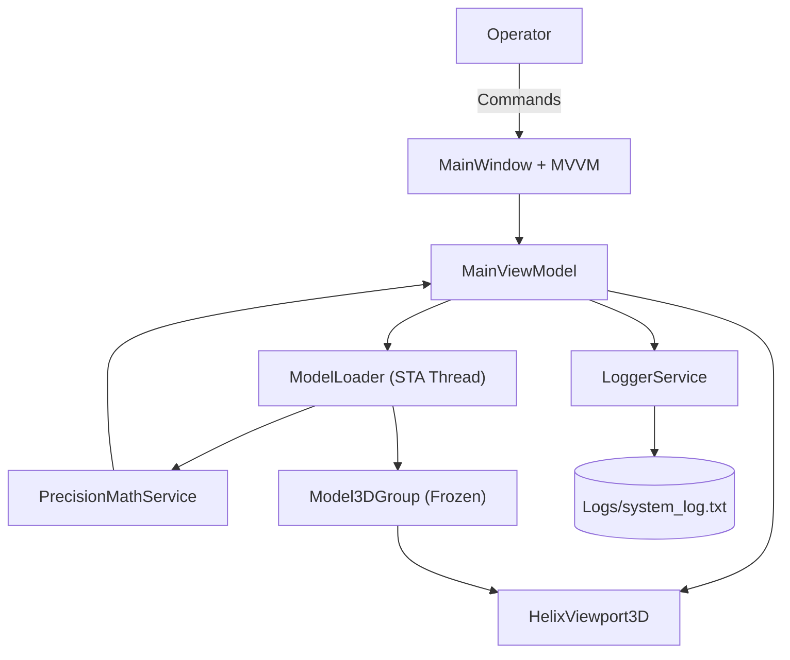
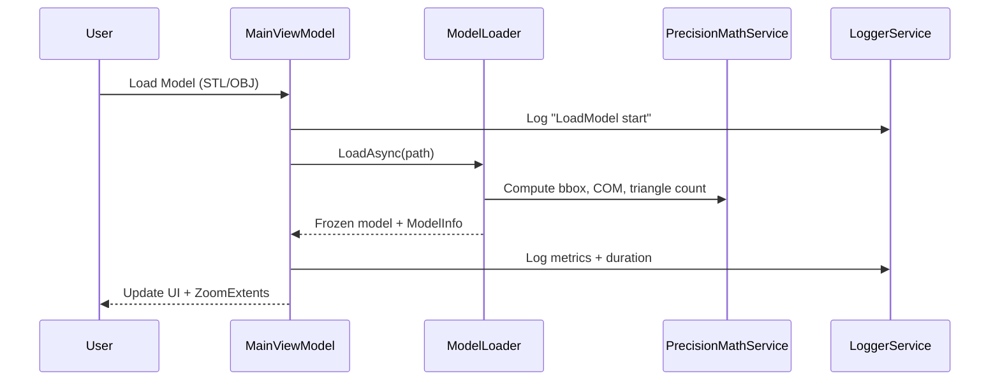
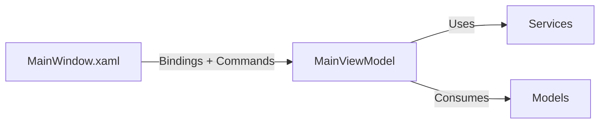

# Surgical Visualization

A precision-focused WPF desktop application for inspecting and aligning 3D surgical models. The project centers on deterministic geometry calculations, traceable logging, and a clean MVVM architecture to support robot-assisted surgical guidance workflows in a controlled, reproducible way.

The solution lives in `SurgicalVisualization/` and ships with a HelixToolkit-based viewport for STL/OBJ import, metrics extraction, and camera telemetry.

---

## Project Description

SurgicalVisualization is designed for surgical planning and instrument alignment scenarios where **precision, repeatability, and auditability** are critical. The application:

- Loads STL/OBJ models on a dedicated STA thread and **deep-freezes** them for safe UI consumption.
- Computes **deterministic metrics** (triangle count, bounding box, center of mass) using `double` precision.
- Provides alignment tools based on **quaternion math** to orient the active model to a known target vector.
- Emits UTC, invariant-culture logs for traceability and post-session analysis.

This combination enables a reliable visualization pipeline and a consistent data trail for research or clinical simulation environments.

---

## Key Capabilities

- **3D Model Import**: STL and OBJ (with MTL + textures where available).
- **Viewport Interaction**: rotate, pan, zoom, and reset controls.
- **Deterministic Metrics**: triangle counts, bounding box sizes, center of mass, and load duration.
- **Alignment Workflow**: aligns the principal axis of the model to a target vector using quaternion rotation.
- **Telemetry**: FPS reporting, camera position/look direction, and orientation readouts.
- **Export Tools**: screenshots and append-only log export.

---

## Architecture Overview



**Highlights**
- The **ModelLoader** runs on a dedicated **STA thread** to safely create WPF 3D objects.
- All geometry artifacts are **deep-frozen** before they reach the UI layer.
- **MainViewModel** is the orchestration hub, coordinating metrics, logging, and viewport updates.

---

## Model Loading & Metrics Pipeline



---

## MVVM Interaction Diagram



---

## Repository Layout

```
SurgicalVisualization/
├─ README.md
├─ SurgicalVisualization/
│  ├─ App.xaml / App.xaml.cs
│  ├─ MainWindow.xaml / MainWindow.xaml.cs
│  ├─ ViewModels/
│  │  └─ MainViewModel.cs
│  ├─ Models/
│  │  ├─ ModelInfo.cs
│  │  └─ CalibrationData.cs
│  ├─ Services/
│  │  ├─ ModelLoader.cs
│  │  ├─ PrecisionMathService.cs
│  │  └─ LoggerService.cs
│  ├─ Helpers/
│  │  ├─ RelayCommand.cs
│  │  ├─ FileDialogHelper.cs
│  │  └─ StaTask.cs
│  ├─ Assets/
│  ├─ Logs/
│  └─ SurgicalVisualization.sln
```

---

## Build & Run

1. Open `SurgicalVisualization/SurgicalVisualization.sln` in Visual Studio 2022 or newer.
2. Install the **.NET desktop development** workload if needed.
3. Target `net9.0-windows` (or adjust to `net8.0-windows`).
4. Restore NuGet packages, then **Build** and **Run**.
5. Use **Load Model** to import STL/OBJ files.

## Run in a Browser

The repository also includes a browser viewer at `SurgicalVisualization/index.html`.

1. Open a terminal in the project subfolder:
   ```bash
   cd SurgicalVisualization
   ```
2. Start a local static web server (required so ES modules and local file loading work correctly):
   ```bash
   python -m http.server 8000
   ```
3. Open your browser to:
   ```
   http://localhost:8000/index.html
   ```

> You should run through a local server rather than opening `index.html` directly from the filesystem (`file://`), otherwise browser security rules can block module imports and model loading.

---

## Logging & Determinism Notes

- Logs are written in UTC ISO-8601 format to `SurgicalVisualization/Logs/system_log.txt`.
- Metrics are computed using `double` precision and invariant culture formatting.
- All imported geometry is deep-frozen to avoid cross-thread WPF access errors.

---

## Troubleshooting Notes

- **OBJ not visible**: confirm `.mtl` and texture files are next to the `.obj` file.
- **Black model**: missing textures may leave geometry unlit; try Reset View.
- **Thread ownership errors**: ensure imports run through `ModelLoader` (STA + deep-freeze).

---

## Additional Documentation

For a more implementation-focused README, see `SurgicalVisualization/README.md` in the project directory.
