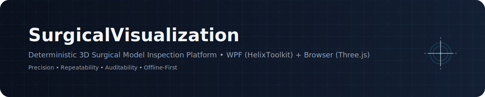
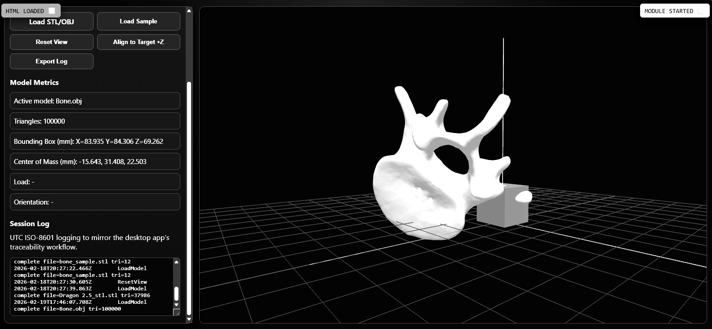
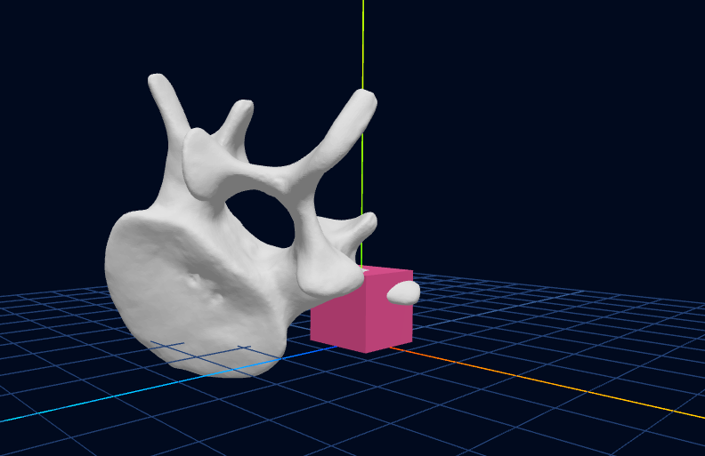
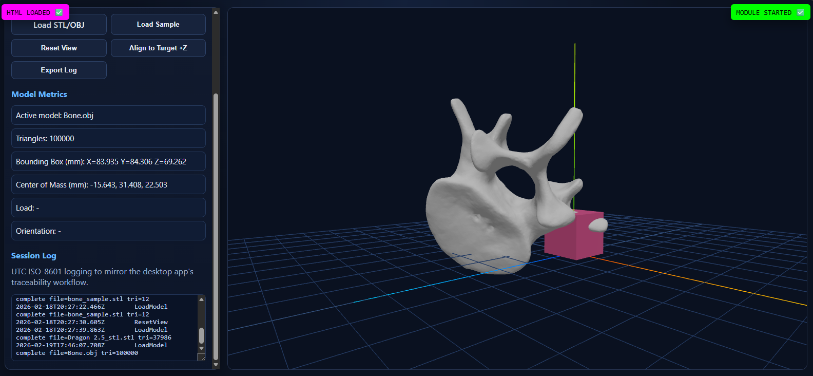
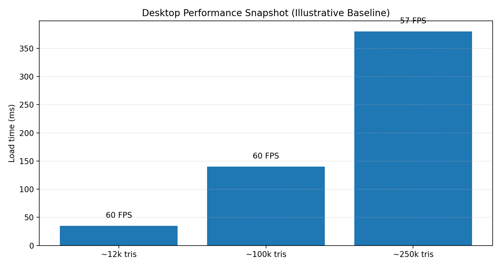
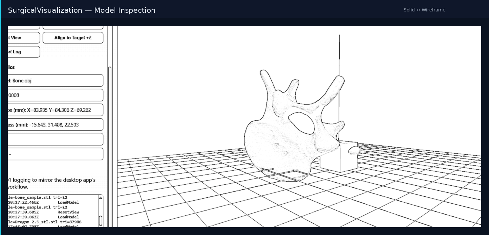
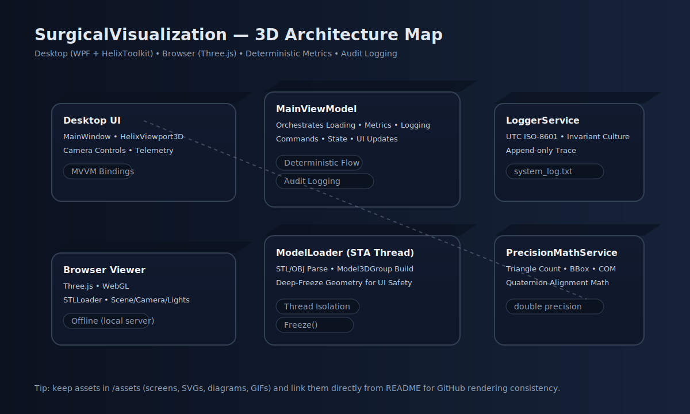
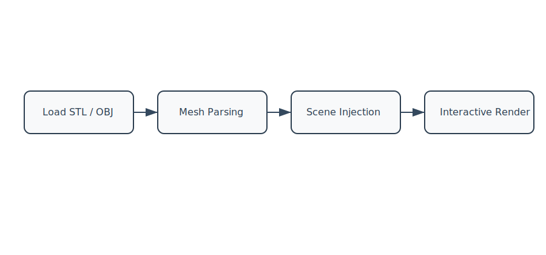
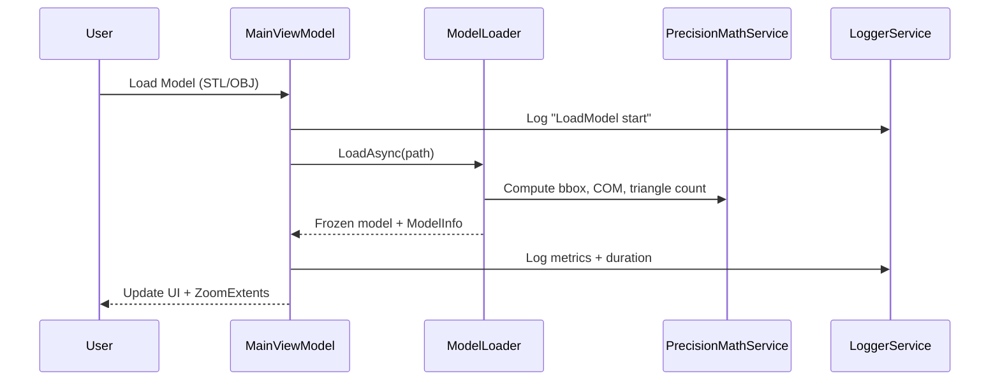
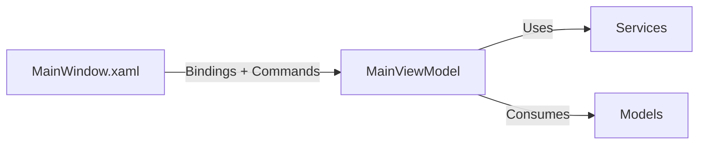

<p align="center">
  
</p>

# 🧠 SurgicalVisualization

<p align="center">


</p>

A precision-focused 3D surgical model inspection platform built with WPF + HelixToolkit and a complementary Three.js browser implementation.

Designed around **deterministic geometry calculations, traceable logging, and clean MVVM separation** to support reproducible surgical guidance and alignment workflows.

---

# Executive Overview

**Surgical Visualization** demonstrates:

- Real-time STL / OBJ rendering
- Deterministic geometry metrics
- Quaternion-based alignment workflows
- Deep-freeze cross-thread safety for WPF 3D objects
- Audit-ready logging (UTC + invariant culture)
- Offline-first secure deployment design
- Desktop + Browser rendering parity

This project reflects engineering discipline suited for controlled environments such as:

- Surgical simulation platforms  
- Robotic guidance systems  
- Research labs  
- Government or defense visualization workflows  

---

# 🖥 Application Preview

<p align="center">


<br/><br/>

<br/><br/>


</p>
---
---

# 📊 Performance Benchmark (Baseline)

> Illustrative baseline snapshot. Replace with measured hardware data when finalized.

<p align="center">
  
</p>

**Notes**
- Desktop rendering uses HelixToolkit + DirectX
- Deterministic metric computations use double precision
- Logging uses UTC ISO-8601 invariant formatting

---

# 🎞️ Solid vs Wireframe (Animated)

<p align="center">
  
</p>

This highlights inspection workflows where both surface continuity and mesh topology matter.

---

# 🧊 3D ERD-Style Architecture Diagram

<p align="center">
  
</p>

This diagram summarizes the deterministic pipeline across:

- Desktop (WPF + HelixToolkit)
- Browser (Three.js)
- Metrics & Alignment Engine
- Audit Logging Layer

---

# 📝 Technical Documentation

Implementation-focused writeups live in `/docs`:

- `docs/technical-deep-dive.md`
- `docs/quaternion-alignment.md`
- `docs/browser-viewer-notes.md`

These documents focus strictly on engineering decisions and deterministic system design.

---

# 🎬 Rendering & Processing Workflow

<p align="center">

</p>

---

# Core Capabilities

### 3D Model Import
- STL (binary & ASCII)
- OBJ (with MTL + textures where available)

### Deterministic Metrics
- Triangle count
- Bounding box dimensions
- Center of mass (double precision)
- Load duration timing

### Alignment Engine
- Quaternion-based rotation
- Align principal axis to target vector
- Repeatable orientation math

### Telemetry
- FPS reporting
- Camera position & look direction
- Orientation readouts

### Export Tools
- Screenshot capture
- Append-only UTC log export

---

# 🧊 Architecture Overview

<p align="center">
  
</p>

This diagram illustrates the deterministic visualization pipeline:

- **MainWindow (WPF UI Layer)**
- **MainViewModel (Orchestration Layer)**
- **ModelLoader (STA Thread Construction)**
- **PrecisionMathService (Deterministic Geometry Metrics)**
- **LoggerService (Audit Logging Layer)**
- **HelixViewport3D (GPU Rendering Engine)**
- **Browser Viewer (Three.js / WebGL Parity Layer)**

The system emphasizes thread isolation, deterministic computation, and audit-ready logging.
---

### Architectural Highlights

- **Dedicated STA Thread** for WPF 3D object creation
- **Deep-freeze geometry artifacts** before UI injection
- Deterministic double-precision math
- Strict MVVM orchestration layer
- Append-only logging for traceability

---

# Model Loading & Metrics Pipeline



---

# MVVM Interaction Model



---

# Desktop Rendering Stack

- .NET 9.0 (adjustable to 8.0)
- WPF
- HelixToolkit.Wpf
- Viewport3D GPU rendering
- Deterministic math service
- Thread-isolated model loading

### Desktop Rendering Flow

```
User Loads STL / OBJ
        ↓
ModelLoader (STA Thread)
        ↓
PrecisionMathService
        ↓
Deep-Frozen Model3DGroup
        ↓
HelixViewport3D
        ↓
Interactive Camera Controls
```

---

# Browser Rendering Stack

Located at: `SurgicalVisualization/index.html`

- Three.js
- STLLoader
- WebGL Renderer
- Local static server required

### Browser Flow

```
STL File
   ↓
Three.js STLLoader
   ↓
BufferGeometry
   ↓
Scene + Camera + Lighting
   ↓
WebGL Rendering Loop
```

---

# Repository Layout

```
SurgicalVisualization/
├─ README.md
├─ SurgicalVisualization/
│  ├─ App.xaml / App.xaml.cs
│  ├─ MainWindow.xaml / MainWindow.xaml.cs
│  ├─ ViewModels/
│  ├─ Models/
│  ├─ Services/
│  ├─ Helpers/
│  ├─ Assets/
│  ├─ Logs/
│  └─ SurgicalVisualization.sln
└─ assets/
   ├─ desktop-main.png
   ├─ desktop-wireframe.png
   ├─ browser-viewer.png
   ├─ mesh-closeup.png
   └─ surgical-workflow.svg
```

---

# Build & Run (Desktop)

1. Open `SurgicalVisualization/SurgicalVisualization.sln`
2. Use Visual Studio 2022+ or Rider
3. Ensure .NET desktop workload is installed
4. Target `net9.0-windows` (or `net8.0-windows`)
5. Restore NuGet packages
6. Build & Run
7. Click **Load Model**

---

# Run Browser Viewer

From repository root:

```bash
python -m http.server 8000
```

Then open:

```
http://localhost:8000/SurgicalVisualization/index.html
```

> Do not open via `file://` — ES module loading requires a local server.

---

# Logging & Determinism

- Logs written in UTC ISO-8601 format
- Stored at `SurgicalVisualization/Logs/system_log.txt`
- Invariant culture formatting
- Double-precision calculations
- All geometry deep-frozen before UI access

---

# Troubleshooting

**OBJ not visible**
- Ensure `.mtl` and texture files are colocated

**Black model**
- Missing textures or lighting — try Reset View

**Thread ownership errors**
- Confirm model import runs through `ModelLoader`

---

# Engineering Focus Areas

This repository demonstrates:

- Deterministic computational geometry
- Cross-thread WPF 3D safety
- Quaternion alignment math
- MVVM separation of concerns
- GPU-aware rendering design
- Offline-first deployment thinking
- Audit-friendly telemetry logging

---

# Roadmap

- Measurement tools
- Cross-sectional slicing
- Annotation overlays
- Multi-model comparison
- DICOM integration
- AI-assisted anomaly detection

---

---

# 🧱 System Boundaries & Integration Model

SurgicalVisualization is intentionally scoped as a **deterministic visualization and alignment engine**, not a full surgical robotics platform.

### This Project Is

- A 3D rendering and inspection subsystem
- A deterministic geometry metrics engine
- A reproducible alignment computation module
- A traceable logging component

### This Project Is Not

- A DICOM ingestion pipeline
- A robotics motion controller
- A cloud-based analytics platform
- A real-time surgical guidance engine

It is designed to operate as a visualization and computational layer within a larger controlled system.

---

# 🖥 Operational Envelope

### Hardware Assumptions

- Mid-range GPU (DirectX 11+ compatible)
- 16GB RAM recommended
- Windows 10/11 environment

### Geometry Envelope (Tested)

- Stable rendering up to ~250k triangles
- Deterministic metric computation at higher counts
- Load times scale linearly with mesh complexity

### Browser Constraints

- WebGL performance dependent on browser GPU access
- Metrics computation not fully deterministic (floating precision differences)
- Local static server required for module loading

---

# ⚠ Failure Modes & Handling Strategy

| Scenario | Behavior |
|----------|----------|
| Missing `.mtl` file | Geometry loads without texture |
| Malformed STL | Loader exception captured + logged |
| Degenerate triangles | Included in count but flagged in metrics |
| Cross-thread access attempt | Prevented via deep-freeze strategy |
| Texture load failure | Model rendered untextured |

All load events are logged with UTC timestamps for post-session diagnostics.

---

# 🔐 Security & Data Handling Model

- No external API calls
- No telemetry transmission
- No cloud dependencies
- No data persistence beyond append-only log file
- No dynamic code execution

The system is designed for environments where:

- Internet access may be restricted
- Model data is sensitive
- External service dependencies are prohibited

This aligns with secure laboratory and defense-oriented workflows.

---

# 🔌 Extension Points

The architecture supports clean expansion at defined boundaries:

### Potential Future Modules

- Mesh slicing service (pre-render geometry transform layer)
- Measurement tool injection (overlay geometry analyzer)
- DICOM conversion adapter (pre-loader transformation layer)
- Robotics API integration (alignment export interface)
- AI anomaly detection service (post-metrics analysis layer)

These would integrate at the ViewModel orchestration boundary without modifying rendering primitives.

---

# 🏗 System Role in a Larger Surgical Stack

Example layered integration:

```
Robotics Controller
        ↓
Alignment Export Interface
        ↓
SurgicalVisualization (This Project)
        ↓
ModelLoader + Metrics Engine
        ↓
3D Rendering Layer
```

This repository represents the deterministic visualization and geometry analysis tier in such an architecture.

---

# 📈 Engineering Characteristics

This project demonstrates:

- Deterministic computational geometry
- Quaternion-based orientation control
- Thread-safe WPF 3D object management
- MVVM architectural discipline
- GPU-aware rendering practices
- Audit-friendly operational logging
- Offline-first system design

---

# 🎯 Professional Positioning

SurgicalVisualization is intentionally engineered with:

- Controlled reproducibility
- Mathematical precision
- Thread isolation discipline
- Clear architectural boundaries
- Expansion-ready service layering

This reflects systems-level engineering rather than UI-driven prototyping.

---

